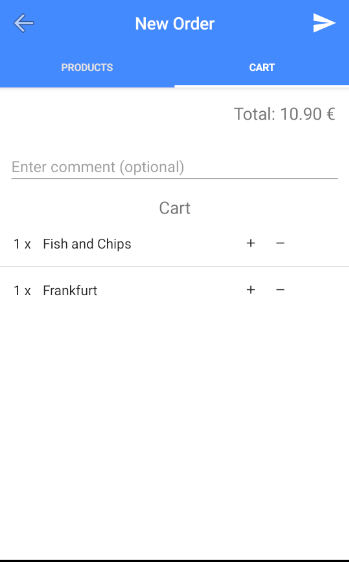

# Weatley

  

## What does Weatley do?

Weatley is a hotel management system software to speed up the entire management and administration
process of a hotel and give more comfort and well-being to the hosts by automating the process
of entries and outings, access to hotel information, and request of products and/or services.

---

## Screenshots

### Weatley Web (Admin Panel)

  Dashboard
  

  Calendar
  

  Booking Management
  

  Notifications (Reports and Orders)
  

### Weatley App (Customer)

Login

  

Hotel

  

Activities

  

Services

  

Orders

  

New Order Products

  

New Order Cart

  

Report

  

---

## Technologies used

Weatley.Web contains the website, done with Angular 7.

Weatley.Backend contains the backend, done with .NET Core 2.1

Weatley.App contains the application, done with Nativescript + Angular

---

## How to use it

On the Weatley.Web folder

`ng serve --open`

On the Weatley.App folder

`tns run android/ios //You must own a ios machine to run in ios`

---
